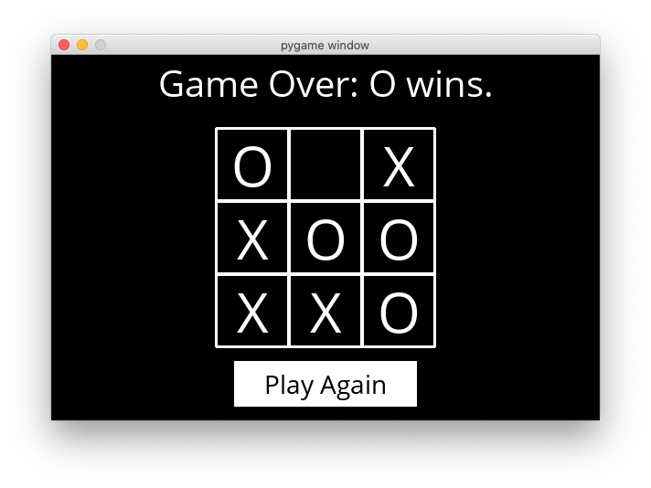

# Tictactoe

## An AI to play Tic-Tac-Toe.

Tic-Tac-Toe is a paper-and-pencil game for two players, X and O, who take turns marking the spaces in a 3×3 grid. The player who succeeds in placing three of their marks in a diagonal, horizontal, or vertical row is the winner. It is a solved game with a forced draw assuming best play from both players. Using Minimax algorithm, we can implement an AI to play Tic-Tac-Toe optimally.

**Minimax**

## Implementation

There are two main files in this project: `runner.py`, which contains all of the code to run the graphical interface for the game; and `tictactoe.py`, which contains all of the logic for playing the game, and for making optimal moves.

In `tictactoe.py`, we define three variables: `X`, `O`, and `EMPTY`, to represent possible moves of the board.

The function `initial_state` returns the starting state of the board. For this problem, we represent the board as a list of three lists (representing the three rows of the board), where each internal list contains three values that are either `X`, `O`, or `EMPTY`.

The `player` function takes a `board` state as input, and returns which player’s turn it is (either `X` or `O`). In the initial game state, `X` gets the first move. Subsequently, the player alternates with each additional move.

The `actions` function returns a set of all of the possible actions that can be taken on a given board. Each action is represented as a tuple `(i, j)` where `i` corresponds to the row of the move (0, 1, or 2) and `j` corresponds to which cell in the row corresponds to the move (also 0, 1, or 2). Possible moves are any cells on the board that do not already have an `X` or an `O` in them.

The `result` function takes a `board` and an `action` as input, and returns a new board state, without modifying the original board. If `action` is not a valid action for the board, your program should raise an exception. The returned board state is the board that would result from taking the original input board, and letting the player whose turn it is make their move at the cell indicated by the input action. The original board is left unmodified: since Minimax will ultimately require considering many different board states during its computation.

The `winner` function accepts a board as input, and returns the winner of the board if there is one. One can win the game with three of their moves in a row horizontally, vertically, or diagonally. If there is no winner of the game (either because the game is in progress, or because it ended in a tie), the function returns `None`.

The `terminal` function accepts a board as input, and returns a boolean value indicating whether the game is over. If the game is over, either because someone has won the game or because all cells have been filled without anyone winning, the function returns `True`. Otherwise, the function returns `False` if the game is still in progress. 

The `utility` function accepts a terminal board as input and output the utility of the board. If `X` has won the game, the utility is `1`. If `O` has won the game, the utility is `-1`. If the game has ended in a tie, the utility is `0`.

The `minimax` function takes a board as input, and returns the optimal move for the player to move on that board. The move returned is the optimal action `(i, j)` that is one of the allowable actions on the board. If multiple moves are equally optimal, any of those moves is acceptable. If the board is a terminal board, the `minimax` function returns None.

Since Tic-Tac-Toe is a tie given optimal play by both sides, you should never be able to beat the AI (though if you don’t play optimally as well, it may beat you).

## Resources

* [Search - Lecture 0 - CS50's Introduction to Artificial Intelligence with Python 2020][cs50 lecture]

## Usage

**To install pygame:**

* Inside the `tictactoe` directory: `pip3 install -r requirements.txt`

**To play Tic-Tac-Toe against the AI:** 

* Inside the `tictactoe` directory: `python runner.py`

## Credits

[*Luis Sanchez*][linkedin] 2020.

Project and images from the course [CS50's Introduction to Artificial Intelligence with Python 2020][cs50 ai] from HarvardX.

[cs50 lecture]: https://youtu.be/D5aJNFWsWew?t=4324
[linkedin]: https://www.linkedin.com/in/luis-sanchez-13bb3b189/
[cs50 ai]: https://cs50.harvard.edu/ai/2020/
